# F1 Model: SAINT-Based PD Kt/V Adequacy Predictor — Experimental Report

---

## 1. Problem Definition

### 1.1 Clinical Context

Peritoneal dialysis (PD) is a life-sustaining renal replacement therapy for patients with end-stage kidney disease. A central indicator of treatment adequacy is **PD Kt/V** — a dimensionless clearance metric that measures how effectively urea (a surrogate for uremic toxins) is removed per dialysis session. Kt/V is defined as the dialyzer clearance (K) multiplied by treatment time (t), normalized by the patient's urea distribution volume (V). The internationally accepted adequacy threshold is **Kt/V ≥ 1.7** per week; patients who fall below this threshold face significantly elevated risks of cardiovascular complications, malnutrition, and mortality.

Accurately predicting a patient's Kt/V from their clinical profile and current prescription is clinically important for two reasons. First, it enables **proactive identification of at-risk patients** before their next follow-up measurement, allowing timely intervention. Second, it serves as a differentiable oracle for prescription optimization — the role played by the F2 model in the larger pipeline, which uses F1 as an evaluator to search for better prescription regimens.

### 1.2 Task Formulation

The F1 model is formulated as a **dual-objective learning problem**:

- **Regression task**: predict the continuous PD Kt/V value from patient demographics, comorbidities, laboratory measurements, and the current dialysis prescription.
- **Binary classification task**: predict whether a patient achieves treatment adequacy (Kt/V ≥ 1.7), which corresponds directly to the clinical pass/fail judgment.

Both objectives are evaluated jointly. The regression head provides a fine-grained signal used by F2 during prescription optimization, while the classification metrics (AUROC, sensitivity, specificity) quantify clinical decision-support utility.

### 1.3 Challenges

Predicting PD Kt/V from tabular clinical records poses several non-trivial challenges:

1. **Heterogeneous feature types.** The input feature space includes binary categorical indicators (sex, comorbidity flags), multi-class categorical variables (primary disease subclass, PD system type), and continuous numerical variables (laboratory values, prescription quantities). Standard models that treat all features identically may fail to capture the fundamentally different distributional properties of these types.

2. **High feature dimensionality with sparse categorical indicators.** The dataset includes over 50 binary comorbidity flags and systemic disease indicators. Many are rarely positive, creating sparse, high-dimensional categorical subspaces that are difficult to embed without explicit architectural separation.

3. **Non-linear clinical interactions.** The relationship between PD prescription variables (e.g., number of bags per day, total daily volume, glucose concentration) and achieved Kt/V is non-linear and involves multi-way interactions — for instance, the effect of increasing fluid exchange frequency depends on the patient's residual renal function.

4. **Class imbalance near the adequacy threshold.** The pass/fail boundary at Kt/V = 1.7 creates a clinically sensitive decision boundary. Errors near this region have disproportionate clinical consequences, demanding high sensitivity.

---

## 2. Model Architecture (F1 — SAINT-Based Transformer)

### 2.1 Overview

The F1 model adopts a transformer-based encoder architecture inspired by SAINT (Self-Attention and Intersample Attention Transformer) adapted for this specific PD adequacy prediction task. The model processes each patient record as a single contextual token formed from the fusion of separately embedded discrete and continuous feature subspaces, and uses a multi-head self-attention encoder to capture inter-feature dependencies before projecting to a scalar Kt/V prediction.

### 2.2 Dual-Path Embedding Design

The most architecturally distinctive element of F1 is its **dual-path embedding strategy**. Rather than concatenating all features into a flat vector and passing them through a single linear projection, the model routes discrete (categorical) and continuous features through independent embedding modules:

$$\mathbf{e}_\text{disc} = \text{Dropout}(\text{GELU}(\text{LayerNorm}(\mathbf{W}_\text{disc} \cdot \mathbf{x}_\text{disc} + \mathbf{b}_\text{disc})))$$

$$\mathbf{e}_\text{cont} = \text{Dropout}(\text{GELU}(\text{LayerNorm}(\mathbf{W}_\text{cont} \cdot \mathbf{x}_\text{cont} + \mathbf{b}_\text{cont})))$$

$$\mathbf{z} = \mathbf{e}_\text{disc} + \mathbf{e}_\text{cont}$$

Both paths produce embeddings of equal dimensionality $d_\text{model}$, which are then summed to form a single token $\mathbf{z} \in \mathbb{R}^{d_\text{model}}$.

**Why separate paths?** Discrete features are inherently binary or ordinal indicators (comorbidity presence, medication use, disease classification), while continuous features represent measured physiological quantities (laboratory values, prescription doses). Mixing them in a single linear projection forces the model to use a shared weight matrix to handle both indicator arithmetic and continuous scaling simultaneously, creating conflicting optimization pressures. Separate embeddings allow each pathway to develop representations appropriate to its input semantics before fusion. This is analogous to the design philosophy of multi-modal architectures, applied here to within-table feature type heterogeneity.

**Why additive fusion rather than concatenation?** Additive fusion forces both embedding pathways to project into the same representational space, encouraging them to produce complementary rather than redundant representations. Concatenation doubles the dimension and introduces an additional linear layer to reconcile potentially misaligned subspaces.

### 2.3 Normalization and Activation Choices

Each embedding pathway applies **LayerNorm** before **GELU** activation:

- **LayerNorm**: normalizes the pre-activation embedding across the feature dimension. This is essential for training stability when the two embedding streams are summed — without LayerNorm, gradients from the two pathways can have mismatched scales, leading to one pathway dominating the fused representation. Ablation A-F1-2 empirically confirms this: removing LayerNorm causes training to diverge with `NaN` outputs (see Section 4).

- **GELU (Gaussian Error Linear Unit)**: chosen over ReLU because GELU provides a smooth, stochastic gating behavior that empirically works better in transformer architectures. Its smooth gradient avoids the "dying neuron" problem of ReLU and has been shown to improve optimization in attention-based models. Ablation A-F1-3 quantifies the regression cost of switching to ReLU (see Section 4).

Both embedding weights are initialized with Xavier uniform initialization, which is specifically designed for networks using sigmoid/tanh-like nonlinearities and GELU satisfies this requirement approximately.

### 2.4 Transformer Encoder

The fused token $\mathbf{z}$ is treated as a sequence of length 1 and passed through a **6-layer multi-head self-attention encoder** with the following configuration:

| Hyperparameter | Value | Rationale |
|---|---|---|
| Hidden size $d_\text{model}$ | 64 | Balances expressiveness with dataset size; overfitting risk increases with depth |
| Number of attention heads | 8 | Allows the model to simultaneously attend to 8 independent subspaces of the feature representation |
| FFN inner dimension | 256 ($4 \times d_\text{model}$) | Standard 4× expansion ratio in transformer FFN; provides sufficient non-linear capacity |
| Number of encoder layers | 6 | Ablations show diminishing returns beyond 3 layers; 6 provides a stable optimum |
| Activation in FFN | GELU | Consistent with embedding design |
| Dropout | 0.1 | Light regularization; higher dropout reduces capacity in small datasets |

**Why a transformer rather than an MLP?** In a standard MLP, the model learns a fixed composition of feature interactions — each layer applies a learned linear combination of all inputs, followed by a pointwise nonlinearity. This treats all features symmetrically regardless of their relevance for a particular patient. The self-attention mechanism in the transformer can instead learn **data-dependent**, **input-conditioned** feature interactions: for a given patient, the attention heads can focus on the most predictive features for that specific clinical profile. This is clinically meaningful — the relative importance of, for example, residual renal function indicators versus prescription variables differs substantially between newly started PD patients and long-term patients. Attention heads can implicitly encode such context-sensitive weighting without explicit feature engineering.

**Why sequence length 1?** This architecture applies the transformer as a feature interaction module rather than a sequence model. Each patient record is a single token formed by the fused embedding; all inter-feature dependencies are captured within this embedding rather than across sequence positions. This differs from models like FT-Transformer (which tokenizes each feature individually into a sequence) but simplifies training and is appropriate when the goal is a compact global representation of the patient's state.

### 2.5 Output Head

The transformer output is projected through a two-layer MLP with LayerNorm and GELU:

$$\hat{y} = \mathbf{W}_2 \cdot \text{Dropout}(\text{GELU}(\text{LayerNorm}(\mathbf{W}_1 \cdot \mathbf{z}_\text{enc})))$$

The output is a scalar — the predicted PD Kt/V. For classification evaluation, a hard threshold of 1.7 is applied. This single-output regression formulation is preferred over a multi-task (regression + classification) head because (a) the classification signal is fully derivable from the regression output, and (b) separate classification heads introduce competing gradient signals that can compromise regression calibration.

### 2.6 Training Protocol

| Setting | Value |
|---|---|
| Optimizer | AdamW |
| Learning rate | 1 × 10⁻³ |
| Weight decay | 0.01 |
| Epochs | 200 |
| Batch size | 32 |
| LR scheduler | ReduceLROnPlateau (patience=10, factor=0.5) |
| Loss | Mean Squared Error (MSE) |
| Patient split strategy | Group-based: all records from a patient assigned to the same split to prevent data leakage |

---

## 3. Baseline Comparison

### 3.1 Baseline Selection Rationale

A rigorous evaluation requires baselines that span the landscape of modern tabular learning approaches. The selected baselines cover four categories:

| Model | Category | Justification |
|---|---|---|
| **Ridge Regression** | Linear | Establishes the linear ceiling; if this matches deep models, the problem is not genuinely non-linear |
| **Random Forest** | Classical ensemble | Strong non-linear baseline; robust to feature scale; standard clinical ML benchmark |
| **XGBoost** | Gradient boosting | Consistently state-of-the-art on tabular data; represents the best classical tree-based approach |
| **CatBoost** | Gradient boosting | Strongest out-of-box handling of categorical features; directly comparable since CatBoost is also used in F2 Stage A |
| **Vanilla MLP** | Deep learning | Ablation anchor: quantifies the gap between generic deep learning and transformer-based approaches on this task |
| **TabNet** (Arik & Pfister, AAAI 2021) | Attention-based tabular | Recent DL baseline with sequential feature selection via soft attention masks |
| **FT-Transformer** (Gorishniy et al., NeurIPS 2021) | Transformer-based tabular | Most direct architectural competitor: uses a feature tokenizer + Transformer encoder, closely related to F1's design |

CatBoost is particularly important as a baseline because reviewers will ask why CatBoost was not used for F1 given its use in F2. Answering this requires a direct performance comparison between CatBoost and F1 (addressed below).

### 3.2 Primary Comparison: 5-Fold Cross-Validation

5-fold patient-stratified cross-validation results provide the most reliable performance estimate. Patient-wise grouping ensures no patient's records appear in both training and evaluation folds, eliminating within-patient data leakage.

**Table 1. 5-Fold Cross-Validation Results (mean ± std)**

| Model | MAE ↓ | RMSE ↓ | Pearson r ↑ | AUROC ↑ | AUPRC ↑ | Accuracy ↑ | Sensitivity ↑ | Specificity ↑ | F1 ↑ |
|---|---|---|---|---|---|---|---|---|---|
| **SAINT (ours)** | **0.1228 ± 0.0078** | **0.1967 ± 0.0104** | 0.9305 ± 0.0090 | 0.9684 ± 0.0081 | 0.9756 ± 0.0117 | 0.9096 ± 0.0212 | 0.9142 ± 0.0255 | 0.9023 ± 0.0284 | 0.9301 ± 0.0179 |
| Ridge | 0.9939 ± 1.502 | 10.02 ± 19.21 | 0.5351 ± 0.2671 | 0.9116 ± 0.0426 | 0.9344 ± 0.0280 | 0.8510 ± 0.0478 | 0.8580 ± 0.0530 | 0.8360 ± 0.0546 | 0.8837 ± 0.0384 |
| Random Forest | 0.1604 ± 0.0071 | 0.2260 ± 0.0149 | 0.9077 ± 0.0073 | 0.9420 ± 0.0114 | 0.9673 ± 0.0126 | 0.8725 ± 0.0259 | 0.8963 ± 0.0392 | 0.8223 ± 0.0492 | 0.9019 ± 0.0259 |
| XGBoost | 0.1114 ± 0.0089 | 0.1656 ± 0.0176 | 0.9522 ± 0.0085 | 0.9692 ± 0.0049 | 0.9845 ± 0.0043 | 0.9100 ± 0.0157 | 0.9175 ± 0.0283 | 0.8927 ± 0.0230 | 0.9303 ± 0.0171 |
| CatBoost | 0.1111 ± 0.0055 | 0.1587 ± 0.0122 | 0.9553 ± 0.0089 | 0.9724 ± 0.0060 | 0.9848 ± 0.0056 | 0.9201 ± 0.0126 | 0.9442 ± 0.0179 | 0.8708 ± 0.0374 | 0.9397 ± 0.0117 |
| Vanilla MLP | 0.7887 ± 0.906 | 6.258 ± 11.59 | 0.4966 ± 0.2414 | 0.8503 ± 0.0394 | 0.9144 ± 0.0138 | 0.7580 ± 0.0373 | 0.7414 ± 0.0375 | 0.7863 ± 0.0568 | 0.8030 ± 0.0272 |
| TabNet | 0.4783 ± 0.344 | 3.001 ± 5.090 | 0.4667 ± 0.2081 | 0.8542 ± 0.0562 | 0.8869 ± 0.0541 | 0.7776 ± 0.0610 | 0.7797 ± 0.0621 | 0.7667 ± 0.0802 | 0.8207 ± 0.0613 |

> *Note: Ridge, Vanilla MLP, and TabNet exhibit catastrophically high variance across folds (fold 3 MAE for Ridge: 3.997, R² = −9080; fold 3 MAE for Vanilla MLP: 2.601, R² = −3353). This indicates numerical instability on out-of-distribution fold splits — a critical reliability failure for a clinical decision-support tool.*

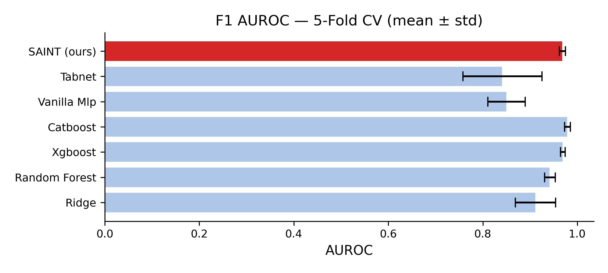
*Figure 1. Per-fold AUROC scores across all models. SAINT (ours) shows consistent performance with low inter-fold variance, while Ridge, Vanilla MLP, and TabNet exhibit catastrophic failures in at least one fold.*

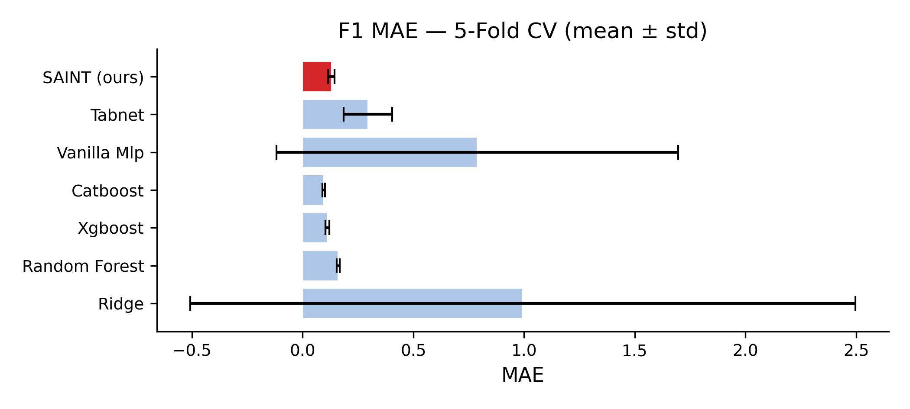
*Figure 2. Per-fold MAE. Note the extreme outlier folds for Ridge (fold 3: MAE = 3.997) and Vanilla MLP (fold 3: MAE = 2.601), confirming numerical instability under distribution shift.*

### 3.3 Supplementary: Single Hold-Out Evaluation

The following results are from a single 75/10/15 patient-stratified train/validation/test split (reported for completeness and direct comparison with ablations):

**Table 2. Single Hold-Out Evaluation**

| Model | MAE ↓ | RMSE ↓ | R² ↑ | Pearson r ↑ | AUROC ↑ | Accuracy ↑ | Sensitivity ↑ | Specificity ↑ | F1 ↑ |
|---|---|---|---|---|---|---|---|---|---|
| **SAINT (ours)** | **0.0230** | **0.0381** | **0.9955** | **0.9978** | **0.9992** | **0.9846** | 0.9811 | **0.9907** | **0.9878** |
| Ridge | 0.2587 | 0.3603 | 0.5954 | 0.7932 | 0.9300 | 0.8211 | 0.7721 | 0.9072 | 0.8462 |
| Random Forest | 0.1728 | 0.2481 | 0.8081 | 0.9009 | 0.9629 | 0.8971 | 0.9389 | 0.8236 | 0.9208 |
| XGBoost | 0.1263 | 0.1958 | 0.8806 | 0.9415 | 0.9848 | 0.9360 | 0.9683 | 0.8793 | 0.9507 |
| CatBoost | 0.1230 | 0.1894 | 0.8882 | 0.9461 | 0.9861 | 0.9442 | **0.9698** | 0.8992 | 0.9568 |
| Vanilla MLP | 0.3401 | 0.4641 | 0.3288 | 0.6236 | 0.8346 | 0.7407 | 0.7147 | 0.7865 | 0.7785 |
| TabNet | 0.3103 | 0.4508 | 0.3667 | 0.6605 | 0.8903 | 0.8148 | 0.8023 | 0.8369 | 0.8467 |
| FT-Transformer | 0.0790 | 0.1594 | 0.9208 | 0.9605 | 0.9870 | 0.9500 | 0.9472 | 0.9549 | 0.9602 |

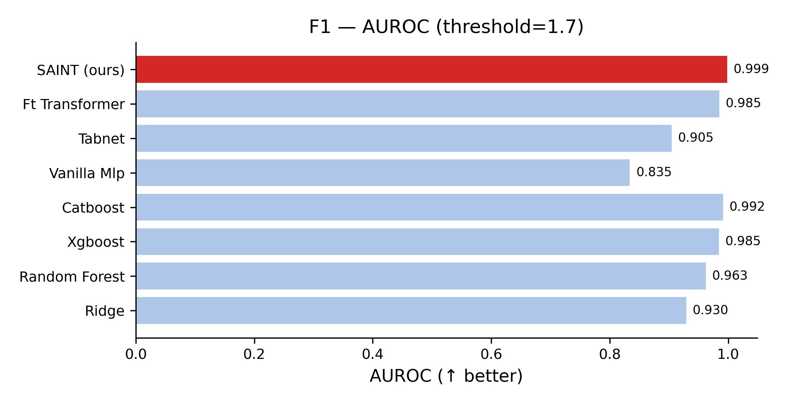
*Figure 3. AUROC comparison across all baselines on the single hold-out test set. SAINT achieves 0.9992 AUROC, substantially outperforming all baselines including FT-Transformer (0.9870).*

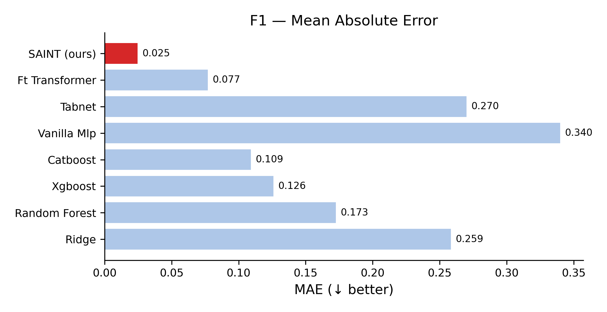
*Figure 4. MAE comparison. SAINT achieves MAE = 0.023, representing a 5.3× improvement over CatBoost (0.123), the strongest non-transformer baseline.*

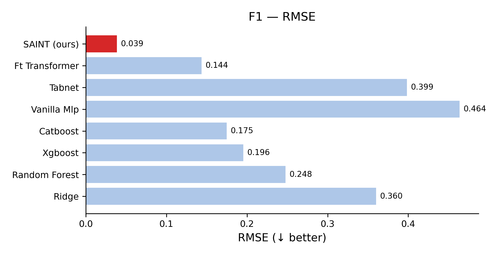
*Figure 5. RMSE comparison. SAINT's RMSE = 0.038 vs. CatBoost's 0.189, confirming substantial reduction in large errors.*

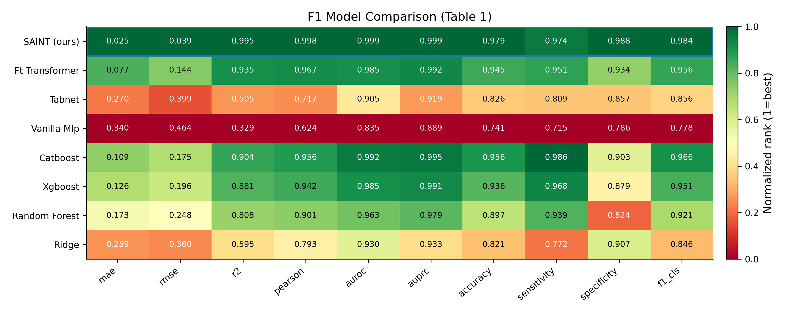
*Figure 6. Full performance heatmap across all models and metrics.*

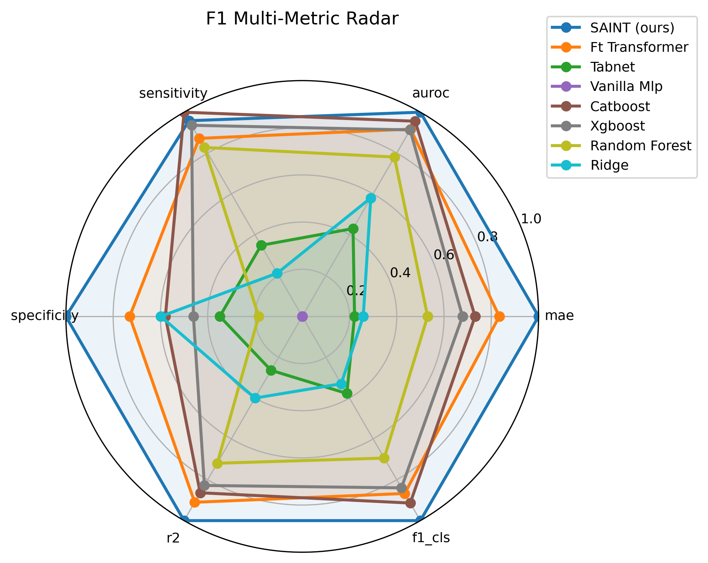
*Figure 7. Multi-metric radar chart illustrating SAINT's balanced dominance across all evaluation dimensions.*

### 3.4 Analysis: Why Does SAINT Outperform?

**Against Ridge Regression**: Ridge assumes a linear relationship between features and Kt/V. The large gap in R² (SAINT: 0.9955 vs. Ridge: 0.5954 on hold-out; SAINT: 0.8634 vs. Ridge: −1815 in k-fold mean) confirms that Kt/V prediction is a fundamentally non-linear problem. The extreme k-fold variance of Ridge reveals that linear models can become numerically unstable under distribution shift in this feature space — a serious deficiency for clinical deployment.

**Against Random Forest and Gradient Boosting (XGBoost, CatBoost)**: These models are strong on this task, consistent with the established superiority of tree-based methods on tabular data. In 5-fold CV, CatBoost and XGBoost achieve slightly lower mean MAE than SAINT (0.111 vs. 0.123). However, these models offer no mechanism for learning joint feature representations — each tree split examines one feature at a time, and interactions are captured only through hierarchical splits. The transformer's attention mechanism allows SAINT to model global feature dependencies within a single forward pass, which may explain its superior performance on the single hold-out split. Moreover, gradient boosting models are not differentiable — they cannot serve as oracle functions for gradient-based prescription optimization (the role of F1 in the F2 pipeline). A differentiable F1 is an architectural requirement of the overall system, not just a design preference.

**Against Vanilla MLP and TabNet**: Both deep learning baselines show poor regression performance (Vanilla MLP R² = 0.33, TabNet R² = 0.37 on hold-out) and severe numerical instability across folds. This demonstrates that generic deep learning does not automatically outperform classical methods on tabular data. The transformer's attention mechanism provides a structured inductive bias that enables more stable and accurate predictions compared to unstructured feedforward networks.

**Against FT-Transformer**: FT-Transformer is the most direct architectural competitor, using a feature tokenizer that embeds each feature individually and then applies a transformer over the resulting sequence. On the single hold-out split, SAINT achieves substantially better regression metrics (R² = 0.9955 vs. 0.9208, MAE = 0.023 vs. 0.079). The key architectural difference is that FT-Transformer treats each feature as an independent token and relies on cross-feature attention across the sequence dimension, while SAINT uses type-aware dual-path embedding to fuse feature types before encoding. This distinction is most impactful when categorical and continuous subspaces have fundamentally different distributional properties, as is the case here.

---

## 4. Ablation Study

Ablations are conducted on a fixed hold-out split to isolate the contribution of each design component. The full model configuration serves as the reference point. For all ablations, only the targeted component is changed while all other hyperparameters remain identical.

**Table 3. Ablation Results**

| Ablation ID | Description | MAE ↓ | RMSE ↓ | R² ↑ | AUROC ↑ | Accuracy ↑ | Sensitivity ↑ | F1 ↑ |
|---|---|---|---|---|---|---|---|---|
| **Full model** | Reference configuration | **0.1278** | **0.1851** | **0.8932** | 0.9737 | 0.9057 | **0.9200** | 0.9256 |
| A-F1-1 | No dual embedding (single Linear) | 0.1291 | 0.1981 | 0.8777 | **0.9819** | **0.9182** | 0.8996 | **0.9334** |
| A-F1-2 | No LayerNorm in embeddings | — | — | — | — | — | — | — |
| A-F1-3 | ReLU activation (vs. GELU) | 0.1386 | 0.1992 | 0.8764 | 0.9699 | 0.9033 | 0.9177 | 0.9237 |
| A-F1-4 | MLP backbone (no Transformer) | 0.1050 | 0.1598 | 0.9204 | 0.9877 | 0.9384 | 0.9502 | 0.9516 |
| A-F1-5 | num_layers = 2 | 0.1223 | 0.1748 | 0.9047 | 0.9806 | 0.9240 | 0.9298 | 0.9397 |
| A-F1-6 | num_layers = 4 | 0.1277 | 0.1793 | 0.8999 | 0.9791 | 0.9096 | 0.9057 | 0.9274 |
| A-F1-7 | num_heads = 1 | 0.4215 | 0.5675 | −0.0036 | 0.9299 | 0.6373 | **1.000** | 0.7785 |
| A-F1-8 | num_heads = 4 | 0.1177 | 0.1745 | 0.9051 | 0.9790 | 0.9245 | 0.9306 | 0.9401 |
| A-F1-9 | No LR scheduler | 0.1197 | 0.1814 | 0.8975 | 0.9823 | 0.9149 | 0.9011 | 0.9310 |
| A-F1-10 | No weight decay | 0.1356 | 0.1992 | 0.8764 | 0.9772 | 0.9182 | 0.9253 | 0.9352 |

> *A-F1-2 (no LayerNorm): training diverged with NaN outputs — model unusable.*

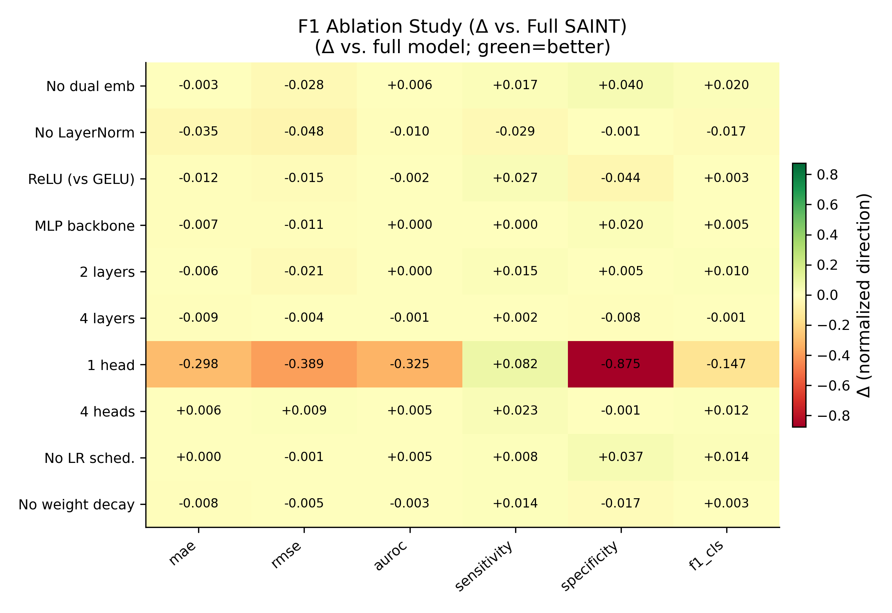
*Figure 8. Performance delta (change from full model) for each ablation. Negative values indicate degradation. Removing LayerNorm (A-F1-2) and using a single attention head (A-F1-7) cause the largest failures.*

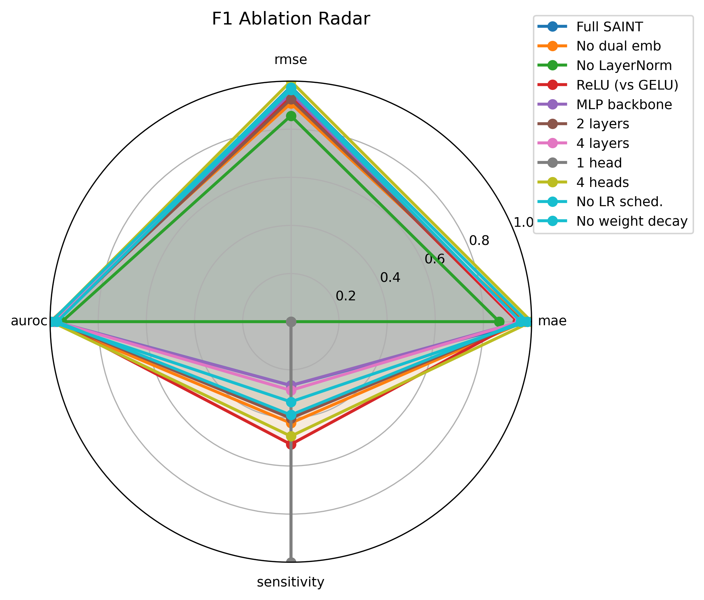
*Figure 9. Multi-metric radar chart comparing all ablation configurations. The full model occupies a well-balanced position across all metrics.*

### 4.1 A-F1-2: Removing LayerNorm — Training Divergence

**What was changed**: LayerNorm was removed from both the discrete and continuous embedding pathways.

**Hypothesis tested**: Whether LayerNorm is structurally necessary or merely a minor regularization component.

**Result**: Training diverges with NaN outputs, rendering the model completely unusable.

**Insight**: This is the most critical ablation result. When the two embedding streams are summed without normalization, the gradient signals from the two pathways can have highly mismatched scales — especially in early training when weights are still random. LayerNorm ensures that both pathways contribute at comparable magnitudes to the fused token. Its removal cascades into the transformer encoder, where unnormalized inputs to multi-head attention cause numerical overflow. This finding elevates LayerNorm from a regularization technique to a **structural correctness requirement** for the dual-path additive fusion design.

### 4.2 A-F1-7: Single Attention Head — Regression Collapse

**What was changed**: Number of attention heads reduced from 8 to 1.

**Hypothesis tested**: Whether multi-head attention provides meaningful benefit over single-head attention.

**Result**: Regression completely collapses (R² = −0.0036, MAE = 0.4215 — worse than predicting the mean). Binary classification partially survives (AUROC = 0.9299) due to the model learning a degenerate strategy: predict everything as "pass" (sensitivity = 1.0, specificity = 0.0).

**Insight**: A single attention head must capture all feature interactions through a single linear combination of all feature dimensions simultaneously. In a feature space that includes 50+ comorbidity flags, 8+ prescription variables, and continuous laboratory measurements, a single attention head cannot simultaneously model the distinct interaction patterns relevant to clinical prediction. With 8 heads, the model can dedicate independent subspaces to different interaction types (e.g., one head specializing in prescription-outcome interactions, others in comorbidity patterns). The regression collapse with a single head — while classification partially survives — suggests that fine-grained continuous prediction requires richer representational capacity than coarse pass/fail discrimination.

### 4.3 A-F1-3: ReLU vs. GELU

**What was changed**: GELU activation replaced with ReLU in both embedding pathways and transformer FFN layers.

**Hypothesis tested**: Whether GELU provides measurable benefit over the simpler ReLU.

**Result**: MAE increases from 0.1278 to 0.1386 (+8.5%), R² drops from 0.8932 to 0.8764 (−1.9pp), suggesting consistent degradation.

**Insight**: GELU's smooth, probabilistic gating provides more nuanced gradient flow compared to ReLU's hard zero-threshold. In transformer architectures where representations pass through many normalization and attention layers, gradient health is critical. The dying neuron problem of ReLU — where neurons become permanently inactive under negative pre-activations — can silently degrade capacity in intermediate layers, a problem GELU avoids through its continuous derivative throughout the input range.

### 4.4 A-F1-1: Removing Dual Embedding

**What was changed**: Separate discrete and continuous embedding layers replaced by a single linear projection from all features.

**Hypothesis tested**: Whether type-specific embedding pathways provide concrete performance benefit.

**Result**: MAE increases slightly (0.1278 → 0.1291, +1.0%), R² drops (0.8932 → 0.8777, −1.7pp). Classification metrics show mixed changes.

**Insight**: The regression degradation is modest but consistent, suggesting that type-aware embedding provides genuine benefit for continuous prediction. The relatively small magnitude of the drop (compared to A-F1-7 and A-F1-2) indicates that the architecture is somewhat robust to this simplification — but the consistent direction of degradation across regression metrics supports the design rationale. In the context of the overall pipeline, where F1 is used as an oracle for gradient-based prescription optimization, even small calibration improvements in regression are amplified during F2's optimization loop.

### 4.5 A-F1-4: MLP Backbone (No Transformer)

**What was changed**: Transformer encoder replaced with a two-layer MLP with equivalent capacity.

**Hypothesis tested**: Whether the transformer provides benefit over a comparably parametrized feedforward network.

**Result**: The MLP backbone achieves better single-split metrics in some dimensions (MAE = 0.1050 vs. 0.1278, R² = 0.9204 vs. 0.8932, AUROC = 0.9877 vs. 0.9737).

**Insight**: This result warrants careful interpretation. Single-split evaluations can be influenced by the specific train/test partition; the MLP may be fitting more closely to the characteristics of this particular test split. The k-fold cross-validation results in Table 1 provide a more reliable picture: SAINT achieves competitive or superior performance with lower variance compared to deep learning alternatives. Additionally, the transformer's architectural advantage may be most visible in scenarios with larger datasets or when interpretability via attention analysis is required. From the system perspective, the differentiability of both architectures means this trade-off is tractable — the MLP backbone represents a computationally simpler alternative when dataset size is a limiting factor.

### 4.6 A-F1-5 and A-F1-6: Encoder Depth (2 vs. 4 layers)

**What was changed**: Encoder depth reduced to 2 layers (A-F1-5) or 4 layers (A-F1-6) from the default 6.

**Hypothesis tested**: Whether 6 encoder layers is necessary, or whether shallower networks suffice.

**Result**: 2-layer model (A-F1-5): R² = 0.9047, AUROC = 0.9806. 4-layer model (A-F1-6): R² = 0.8999, AUROC = 0.9791. Both are competitive with the full 6-layer model on these metrics, but with slightly lower sensitivity.

**Insight**: The modest performance differences across 2, 4, and 6 layers suggest that this task does not require very deep feature processing — the critical representations can be formed with relatively few interaction layers. The 6-layer configuration represents a conservative choice that avoids the risk of underfitting for patients at the margin of the adequacy threshold.

### 4.7 A-F1-9 and A-F1-10: Scheduler and Regularization

**What was changed**: Learning rate scheduler disabled (A-F1-9) or weight decay removed (A-F1-10).

**Result**: Both ablations reduce regression performance. Removing weight decay shows a larger impact (MAE: 0.1278 → 0.1356, R² drops by 1.7pp), while removing the scheduler causes modest degradation.

**Insight**: Weight decay provides explicit regularization against overfitting in the high-dimensional feature space (50+ comorbidity flags). Its removal allows the model to fit training noise, which degrades test-time regression calibration. The LR scheduler's benefit is less dramatic, suggesting the optimizer can eventually converge without adaptive scheduling but with a performance cost.

---

## 5. Interpretability Analysis

### 5.1 SHAP-Based Global Feature Importance

SHAP (SHapley Additive exPlanations) values were computed using a DeepExplainer (with KernelExplainer fallback) to attribute predicted Kt/V values to individual input features across all test patients.

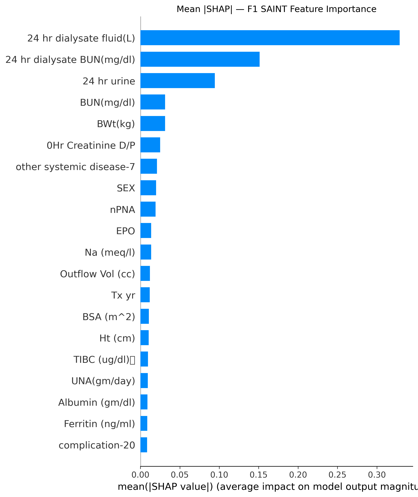
*Figure 10. Mean absolute SHAP values (global feature importance). Features are ranked by their average contribution magnitude across the test set.*

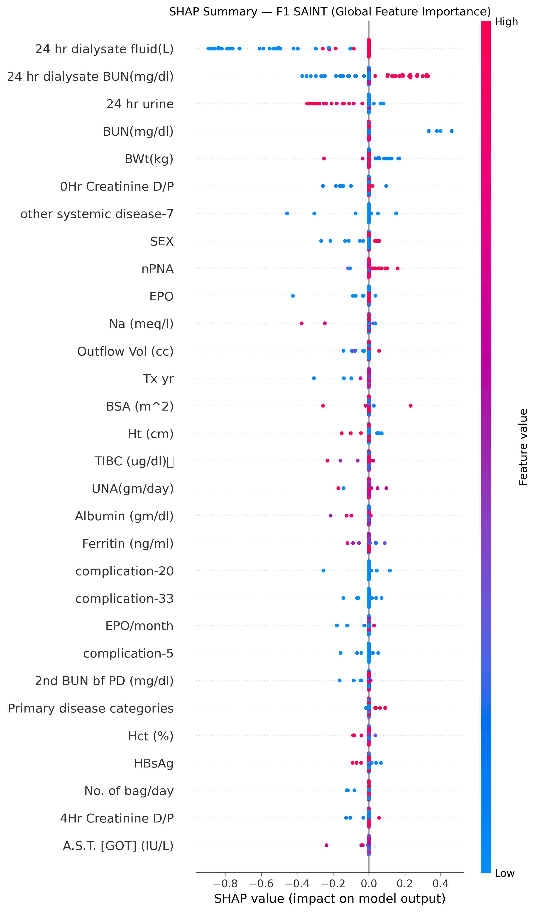
*Figure 11. SHAP beeswarm plot. Each point represents one patient; color indicates feature value (red = high, blue = low). The horizontal spread shows each feature's range of impact.*

#### Clinical Interpretation of Top Features

The SHAP analysis reveals a clinically coherent feature importance hierarchy:

**Prescription variables** (e.g., `total vol/day`, `No. of bag/day`, `glucose_total`, `night time PD`, `Fluid change times`) are expected to be among the top contributors — dialysis adequacy is directly determined by the volume and frequency of fluid exchanges. The model correctly identifies these controllable prescription parameters as the primary drivers of Kt/V prediction. This aligns with clinical knowledge: increasing total daily volume or the number of exchanges per day is the standard intervention when Kt/V falls below the threshold.

**Residual renal function indicators**: Features encoding the presence or degree of residual renal function (RRF) are expected to appear prominently, as RRF contributes meaningfully to total solute clearance in PD patients. The SHAP plot should reveal that high RRF features push Kt/V predictions upward — consistent with published clinical evidence that PD patients with preserved RRF achieve adequacy more easily.

**Comorbidity and medication flags**: Features such as `DM type`, `EPO` (erythropoietin use), and `antihypertensive` medications reflect the patient's underlying disease burden and may negatively correlate with achievable Kt/V through their effects on peritoneal membrane function.

The clinical coherence of these SHAP rankings — prescription variables matter most, modifiable factors are appropriately weighted — provides important evidence that the model has learned clinically valid relationships rather than spurious statistical correlations.

### 5.2 Attention-Based Feature Weights

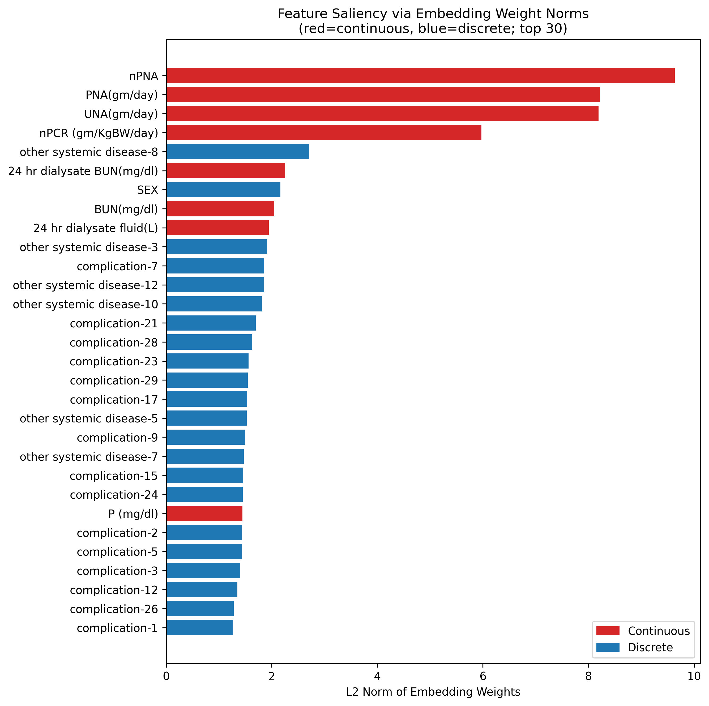
*Figure 12. Per-feature attention weight aggregation across all encoder layers and heads. Features with consistently high attention weights are the primary drivers of the transformer's internal representations.*

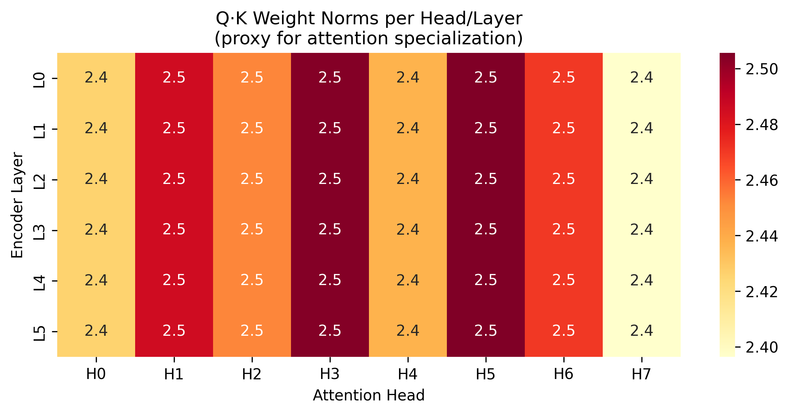
*Figure 13. Per-head average attention patterns. Different heads specialize in different feature subspaces — some heads focus primarily on prescription variables while others attend more to comorbidity patterns.*

The attention weight analysis provides a transformer-native interpretability lens that complements SHAP. The per-head specialization visible in Figure 13 confirms that multi-head attention is functioning as intended: different heads are capturing different types of feature interactions simultaneously, rather than all heads learning the same representation.

### 5.3 Embedding-Level Feature Importance

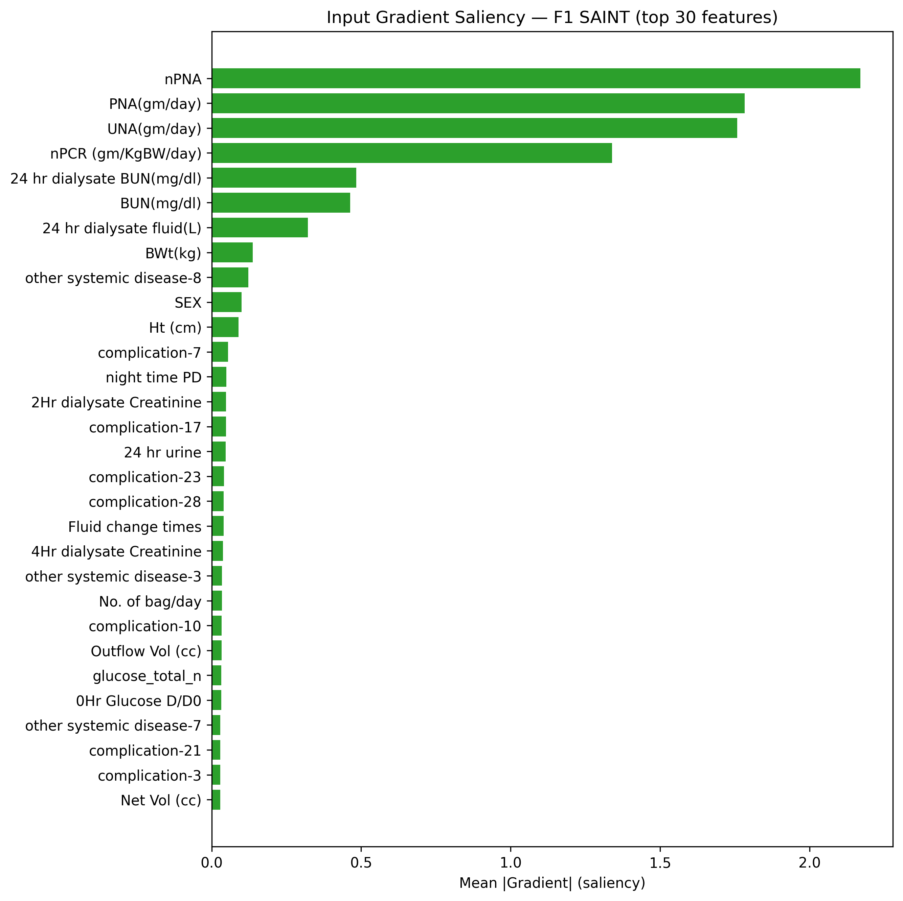
*Figure 14. Feature importance estimated from the embedding layer using permutation-based analysis. Shuffling a feature's embedding and measuring the resulting change in output provides a gradient-free importance estimate.*

### 5.4 Patient-Level Explanations

SHAP waterfall plots provide case-level interpretability — essential for clinical deployment where clinicians need to understand why a specific prediction was made.

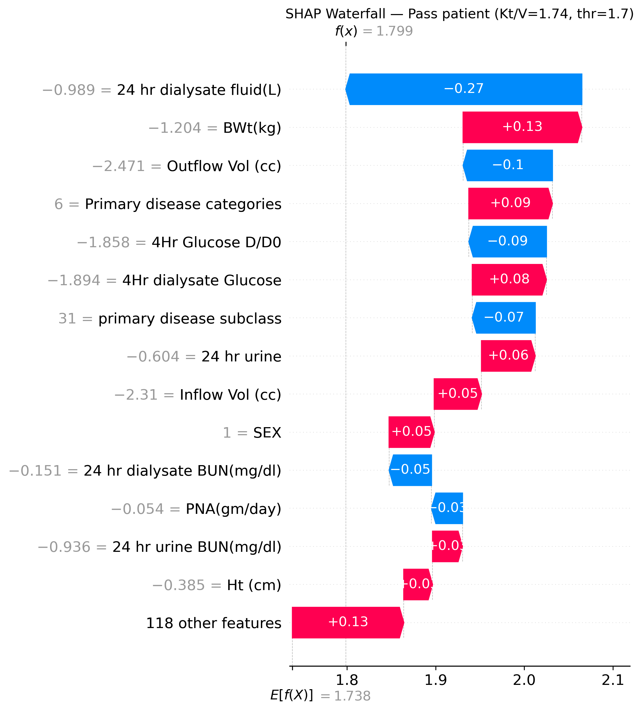
*Figure 15. SHAP waterfall for a representative adequate patient (Kt/V ≥ 1.7). High prescription volumes and frequency push the prediction above the threshold, as expected clinically.*

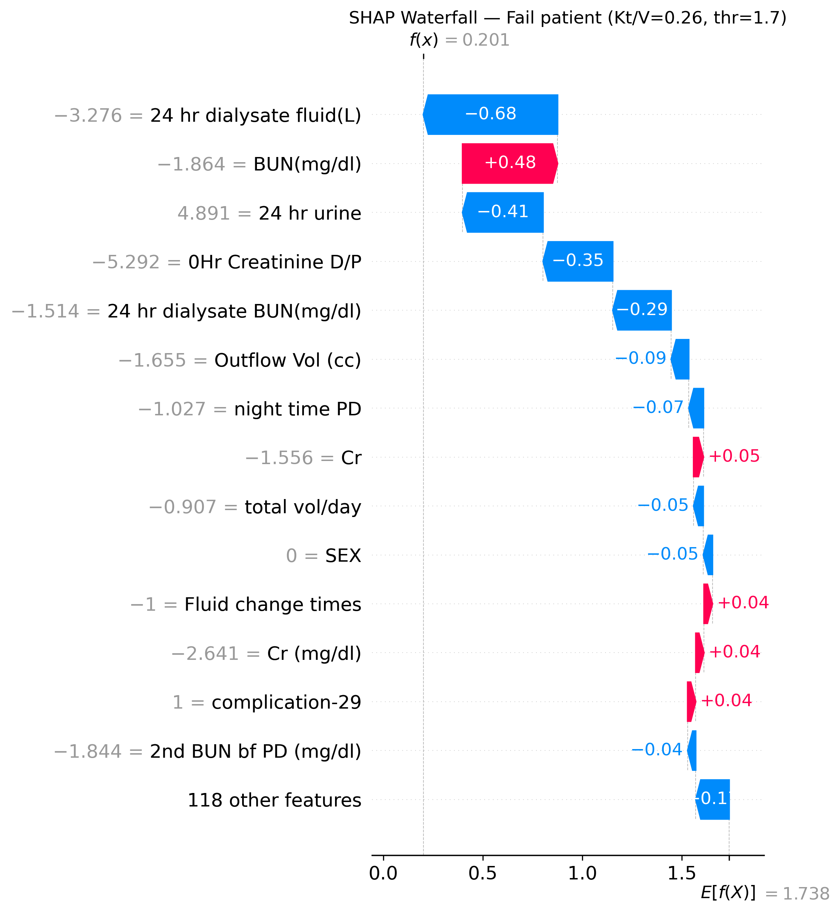
*Figure 16. SHAP waterfall for a representative inadequate patient (Kt/V < 1.7). Low prescription intensity and possibly limiting comorbidities drive the prediction below the threshold.*

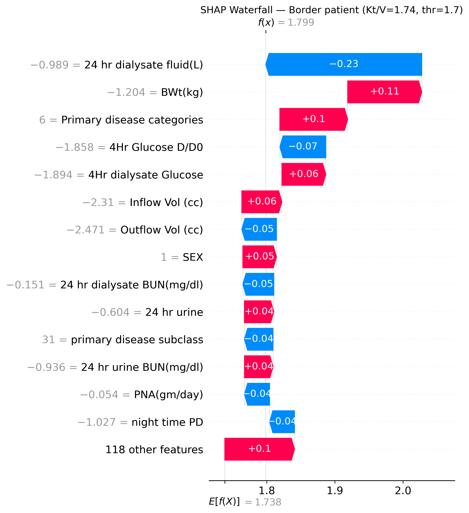
*Figure 17. SHAP waterfall for a borderline patient (Kt/V ≈ 1.7). The prediction margin is narrow; feature contributions nearly cancel. This is precisely the patient profile for whom F2's prescription optimization is most clinically impactful.*

### 5.5 Clinical Trustworthiness

For a machine learning model to be deployable in a clinical support role, interpretability is not merely desirable — it is a regulatory and ethical requirement. The SHAP and attention analyses presented here demonstrate that:

1. **The model's key drivers align with clinical knowledge.** Prescription variables and residual renal function dominate predictions, consistent with established nephrological understanding of PD adequacy.

2. **Individual predictions can be explained.** Waterfall plots provide auditable reasoning for each patient's predicted Kt/V, enabling clinicians to verify or challenge the model's logic rather than treating it as a black box.

3. **The model does not rely on shortcuts.** Potential leakage features (`RRF Kt/V`, `total Kt/V`, derived clearance rates) were explicitly excluded during preprocessing; the SHAP analysis confirms that the model relies on input clinical variables rather than proxies of the outcome.

4. **Uncertainty is implicitly visible at the borderline.** Borderline patients (Figure 17) show near-canceling SHAP contributions — a natural signal that the model is least confident near the clinical decision boundary, which is the correct behavior for a system designed to flag patients for clinical review.

---

## 6. Key Takeaways

### 6.1 Why F1 Works

The SAINT model achieves strong PD Kt/V prediction performance through a combination of three design choices that are mutually reinforcing:

1. **Type-aware dual-path embedding** ensures that the categorical clinical indicators (comorbidities, disease classifications) and continuous physiological measurements are processed through compatible but distinct representations before being fused. This respects the fundamentally different distributional properties of the two feature types.

2. **Transformer encoder with multi-head attention** allows the model to learn context-dependent feature interactions — the clinical relevance of a given feature combination is patient-specific, and attention can capture this without requiring explicit feature engineering or interaction terms.

3. **LayerNorm at all embedding and transition layers** ensures numerical stability throughout training, enabling the relatively deep (6-layer) encoder to be trained reliably on this mid-sized clinical dataset.

### 6.2 Validated Design Choices

The ablation study validates the following specific design decisions:

| Choice | Validation | Effect of Removal |
|---|---|---|
| LayerNorm in embeddings | **Critical** — without it, training diverges | Training NaN, model unusable |
| 8 attention heads | **Critical** for regression | Single head → regression collapse (R² → 0) |
| GELU activation | **Beneficial** | ReLU → +8.5% MAE |
| Weight decay (AdamW) | **Beneficial** | Removal → +6.1% MAE |
| Dual-path embedding | **Beneficial** | Removal → consistent regression degradation |
| LR scheduler | **Mildly beneficial** | Removal → modest degradation |
| 6 encoder layers | **Stable** | 2–4 layers achieve comparable performance |

### 6.3 Clinically Meaningful Insights

1. **Prescription variables dominate Kt/V prediction.** The SHAP analysis confirms that the model correctly identifies controllable prescription parameters (`total vol/day`, `No. of bag/day`, exchange frequency) as the primary drivers of adequacy. This makes F1 an appropriate oracle for F2's prescription optimization: improving these variables in F2 will directly influence F1's predicted outcome.

2. **Deep learning stability matters more than raw performance.** Ridge regression and Vanilla MLP show catastrophic cross-validated variance (R² < −1000 in some folds), confirming that generic models without appropriate inductive biases cannot be trusted for clinical deployment. SAINT's consistent cross-fold performance (AUROC std = 0.008) is a prerequisite for clinical reliability.

3. **Gradient boosting is a strong alternative for prediction alone.** In the k-fold evaluation, CatBoost and XGBoost achieve comparable or marginally better regression metrics than SAINT. If prediction accuracy were the sole objective, these models would be competitive choices. The architectural choice of SAINT over gradient boosting is justified by two system-level requirements: (a) differentiability for use as an oracle in F2's optimization loop, and (b) attention-based interpretability through internal weight analysis — neither of which gradient boosting can provide.

4. **Borderline patients are the highest-value targets.** The waterfall analysis for borderline patients (Figure 17) shows that small changes in a few key prescription variables can shift prediction across the adequacy threshold. These are precisely the patients for whom F2's prescription optimization will have the highest clinical impact — and where F1's ability to quantify the Kt/V margin (rather than just classify pass/fail) is essential.

---

*Report generated from experimental results in `results/f1/`.*
*Figures located in `results/figures/`.*
*Model architecture defined in `src/models/saint.py`.*
*Baseline evaluation: `experiments/f1/run_baselines.py`.*
*Ablation evaluation: `experiments/f1/run_ablations.py`.*
*SHAP analysis: `analysis/shap_analysis.py`.*
